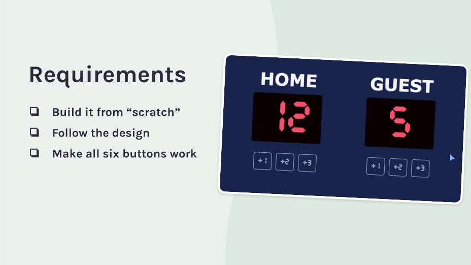
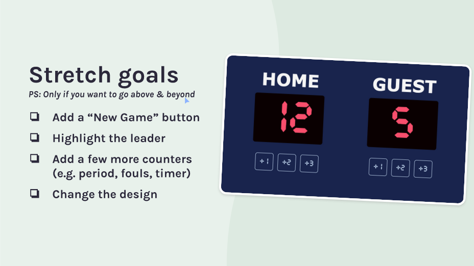
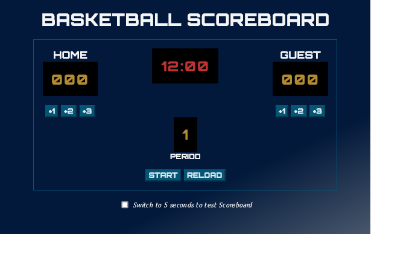
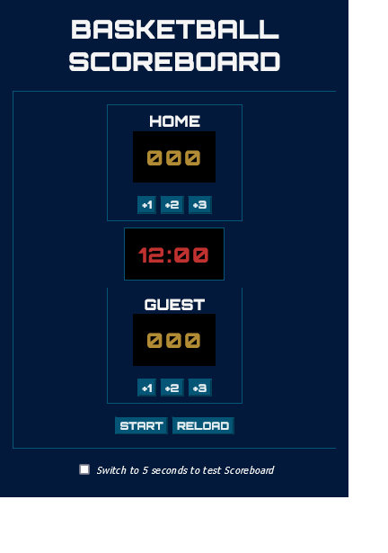

# Basketball Scoreboard | Scrimba's Making Websites Interactive Solo Project

This is my solution to the Scrimba's Basketball Scoreboard from the Making Websites Interactive module of [The Frontend Developer Career Path](https://scrimba.com/learn/frontend/). 

## Table of contents

- [Overview](#overview)
  - [The challenge](#the-challenge)
  - [Stretch Goals](#stretch-goals)
  - [Screenshot](#screenshot)
  - [Links](#links)
- [My process](#my-process)
  - [Built with](#built-with)
- [Author](#author)

## Overview

### The challenge

### Stretch Goals

### Screenshot

### Links

- Solution URL: [GitHub](https://github.com/jumaHarun/oldgram)
- Live Site URL: [Oldagram on Netlify](https://jharun-oldagram.netlify.app/)

## My process

### Built with

- Semantic HTML5 markup
- CSS custom properties
- Flexbox
- Mobile-first workflow

## Author

- LinkedIn - [Juma Harun](https://www.linkedin.com/in/jumaHarun)
- Twitter - [@jumaH4run](https://twitter.com/jumaH4run/)
